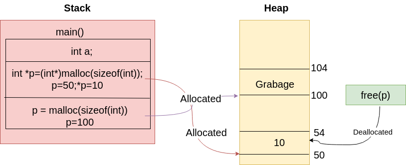

# Dynamic Memory Allocation With Heap:

## 1. DMA Function in C:

-   **malloc:**
-   **calloc**
-   **realloc**
-   **free**

> Application / Use case of these functions discussed further.

## 1. DMA Function in C++:

-   new
-   delete

**Example with Code C:**

```c
    int a;  // goes into stack
    int *p; // m/m address to store content stored is  in stack

    p = (int *)malloc(sizeof(int)); // malloc returns a void pointer which needs to be typecasted
    *p = 10;

    free(p);  // free memory -> first block is deallocated
    p = NULL; // pointer is set to null, so that it can't be dereferenced

    p = (int *)malloc(sizeof(int)); // more memory reserved
```

**Example with Code C++:**

-   New operator is typesafe. No need to typecast.

```c
    int a;  // goes into stack
    int *p; // m/m address to store content stored is  in stack

    p = new int; // no need to typecat
    *p = 10;

    delete p;  // free memory -> first block is deallocated
    p = NULL; // pointer is set to null, so that it can't be dereferenced

    p = new int[20]; // array allocated
    delete[] p; // dealloc
```


