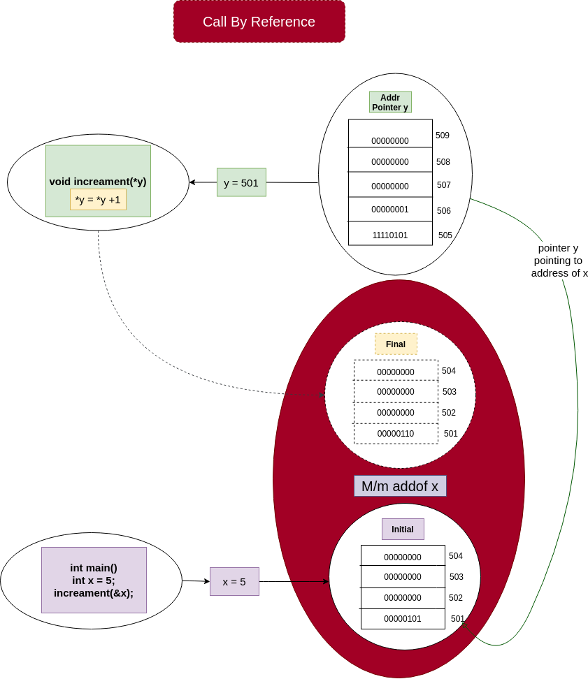

# Pointer as function Argument

-   Call by reference.
-   Instead of passing the variable value, we pass the address of vars to the function

**Syntax:**

```c
// Function signature
int func(int* a, int* b){
    // body
    // a can dereferenced as: *a
    // b can dereferenced as: *b
}

// Call by reference
int x = 1;
int y = 2;

func(&x, &y);
```


