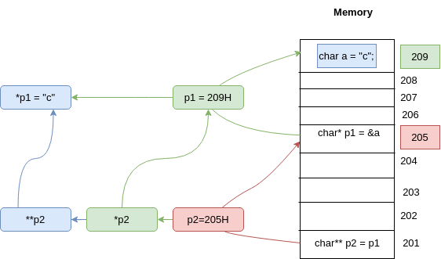

# Pointer to Pointer

-   Pointer pointing to another pointer.
-   Declaration: `<type> **name`
-   Dereferencing: `**name`

```c
char a = "c";
// Let &a = 209H

char *p1 = &x;
// p1 = 209H
// *p1 = a = "c"
// Let &p1 = 205H

char **p2 = p;
//*p2 = &p1 = 205H
// **p2 = *p1 = a = "c"
```

> **&** denotes address


