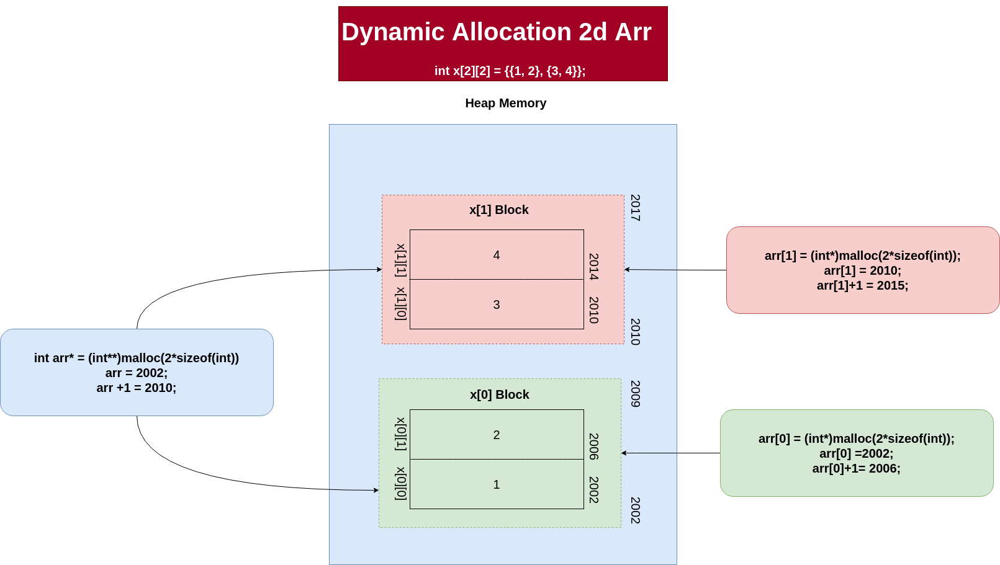

## Dynamic Allocation of 2d Array:

**Example Allocation of 2x2 array.**

```c
    // Allocation for row, allocation using integer pointer type.
    int **arr = (int **)malloc(2 * sizeof(int *));

    // allocation for cols, using integer type
    for (int i = 0; i < 2; i++)
        arr[i] = (int *)malloc(2 * sizeof(int));

    // inserting values
    arr[0][0] = 1;
    arr[0][1] = 2;
    arr[1][0] = 3;
    arr[1][1] = 4;

    // free memory allocated
    for (int i = 0; i < 2; i++)
        free(arr[i]);
```


