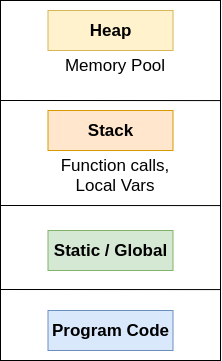
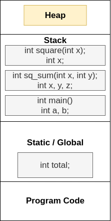

# Dynamic Memory Allocation

**i. Application/Program Memory:**



-   **Code:** M/m address for storing the code, instructions.
-   **Static/Global:** Stores the static and global variables of an application/program.
-   **Stack:** Function Calls, Local variables to the functions.
-   **Heap:** Large freel pool of memory.

> M/m size for first three segment doesnt grow while application is running.

**Example:**

```
#include <stdio.h>
int total;
int square(int x)
{
    return x * x;
}

int sq_sum(int x, int y)
{
    int z = square(x + y);
    return z;
}

int main(int *argc, char *argv[])
{
    int a = 1, b = 2;
    total = sq_sum(a, b);

    printf("Output=%d", total);

    return 0;
}
```

> Memory Allocated


