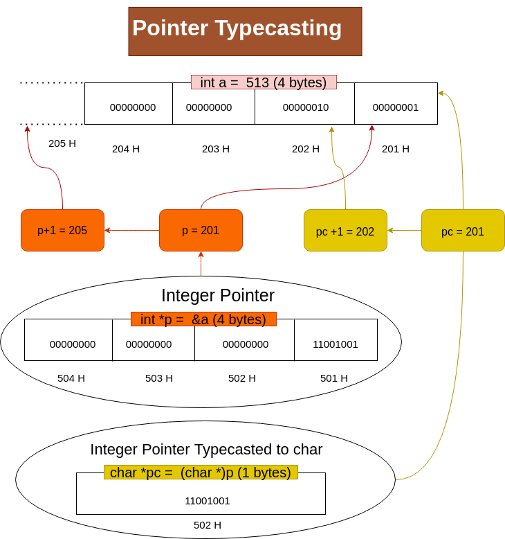

# Pointer TypeCast

-   Changing type (int, char, float) of pointer from one type to other.

**Syntax:**

```text
<type>* p2 = (type *)p1
```

**Example**

```c
int a = 5;

int* pi = &a;
// if pi=2001H then pi+1=2005H
// pi+2 = 2009H

char* cp = (char *) pi;
// cp+1 = 2002H
// cp+2 = 2003H
// cp+3 = 2004H
```

> On changing the pointer type from one type to another, address pointed by increamenting/decrementing the changes.


